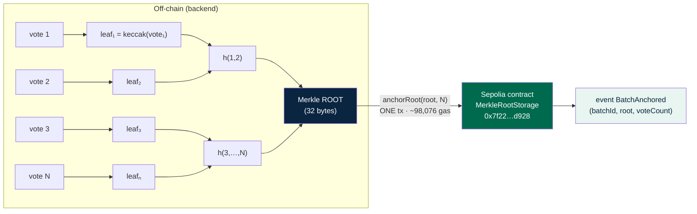
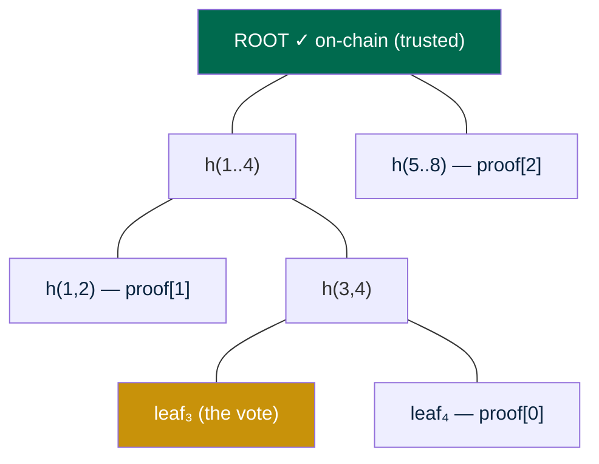
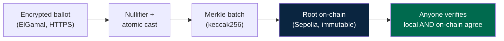

# Anchoring Flow Diagram — N Votes → Tree → 1 Root → 1 Tx

Visual companion to [batching-vs-per-vote.md](batching-vs-per-vote.md) and [anchoring-cost-analysis.md](anchoring-cost-analysis.md). Shows how N votes collapse into a single Merkle root anchored in one transaction, and how any one vote is later proven included.

The live, interactive version of this pipeline is [frontend/src/pages/TamperVisualizer.tsx](../frontend/src/pages/TamperVisualizer.tsx) (`/tamper` in the app).

---

## 1. N votes → tree → 1 root → 1 transaction



**The point:** no matter how large N is, exactly **one** transaction of fixed cost (~98,076 gas steady-state) is sent. Gas does not grow with N — see [anchoring-cost-analysis.md §2.2](anchoring-cost-analysis.md).

### ASCII fallback

```
  N encrypted votes            Merkle tree (keccak256)          1 root        1 transaction
  ─────────────────            ───────────────────────          ──────        ─────────────

  vote 1 ─► leaf₁ ─┐
                   ├─ h(1,2) ─┐
  vote 2 ─► leaf₂ ─┘          │
                             ├─ h(1..4) ─┐
  vote 3 ─► leaf₃ ─┐          │          │
                   ├─ h(3,4) ─┘          ├──►  ROOT  ──► anchorRoot(root, N)
  vote 4 ─► leaf₄ ─┘                     │           ONE tx, ~98,076 gas
                                        ...          (flat, independent of N)
  vote N ─► leafₙ ─► … ────────────────►─┘
```

---

## 2. Inclusion-proof path (proving ONE vote was anchored)

To prove vote 3 was in the batch, you supply only the **sibling hashes** on its path to the root — `ceil(log2 N)` of them — not the whole tree.



**Verification walks upward:**

```
  proof = [ leaf₄, h(1,2), h(5..8) ]          (3 hashes for N=8)

  step 0:  hash(leaf₃, leaf₄)      = h(3,4)
  step 1:  hash(h(1,2), h(3,4))    = h(1..4)
  step 2:  hash(h(1..4), h(5..8))  = ROOT'
  check:   ROOT' == on-chain ROOT  ?  ✓ included   ✗ tampered → HTTP 409
```

If the vote — or the stored root — was altered, `ROOT'` no longer equals the anchored root and verification refuses. This is exactly what [backend/src/routes/anchor.ts](../backend/src/routes/anchor.ts) `GET /anchor/verify/:voteId` does, checking both locally and against the on-chain `verify()`.

Real proof lengths (measured): **1,000 votes → 10 hashes**, **10,000 votes → 14 hashes**. Logarithmic growth keeps proofs tiny at any scale.

---

## 3. End-to-end pipeline (matches the live visualizer)



The final step is the one that catches tampering: it re-derives the proof and requires the local result and the on-chain contract to agree.

---

## References

See [batching-vs-per-vote.md](batching-vs-per-vote.md#references) and [anchoring-cost-analysis.md](anchoring-cost-analysis.md#references) for the full reference list (RFC 6962 Certificate Transparency, MDPI anchoring survey, Merkle-tree primers).
