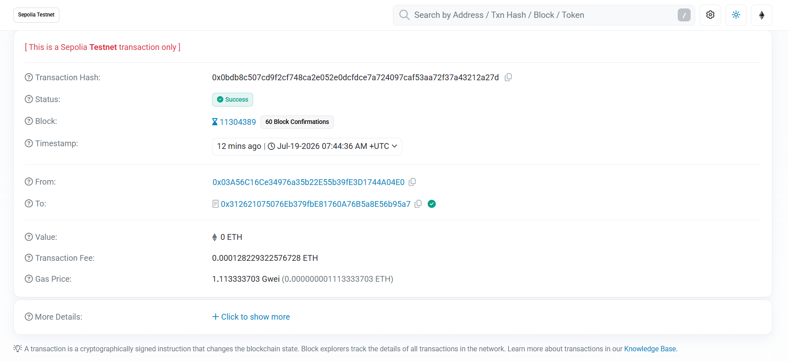
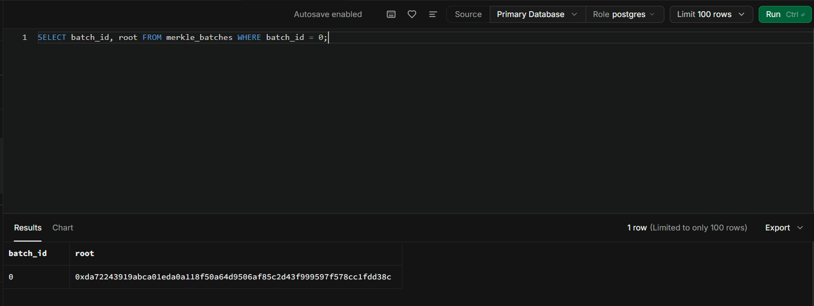
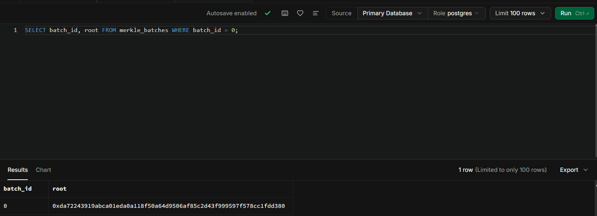

# Tamper-Proof Demo — Live Sepolia Anchoring & Verification

> The centerpiece evidence for the project's core claim: **honest vote data
> verifies against a public blockchain; tampered data is caught.**
>
> This run was executed end-to-end on 2026-07-19 against the live deployed
> `MerkleRootStorage` contract on Ethereum Sepolia and the project's Supabase
> instance. Every command and response below is real, not illustrative.

## Environment

| Item | Value |
|---|---|
| Chain | Ethereum Sepolia testnet (chainId 11155111) |
| Contract | `0x312621075076Eb379fbE81760A76B5a8E56b95a7` |
| Contract explorer | https://sepolia.etherscan.io/address/0x312621075076Eb379fbE81760A76B5a8E56b95a7 |
| Backend | `npm run dev:backend` → `http://localhost:3000` |
| Anchoring config | `backend/.env`: `AMOY_RPC_URL` (legacy var name, holds the Sepolia RPC URL), `MERKLE_CONTRACT_ADDRESS`, `ANCHOR_PRIVATE_KEY`, `ADMIN_SECRET` |

> **Safety note (per `testing_guidance.md` rule #1):** anchoring is irreversible.
> This entire run used seeded/mock voters only (`seed-voters.ts`) — never live data.

## What this demonstrates

1. A batch of votes is hashed into a Merkle tree; only the **root** is written on-chain.
2. Any single vote can be proven to belong to that batch, and the proof is checked
   **both locally and against the on-chain contract** — they must agree.
3. Editing the underlying data after anchoring makes the recomputed root diverge
   from the anchored root, so verification returns **409** instead of a false valid proof.
4. Two independent defenses stack: the on-chain root (catches `merkle_batches` edits)
   **and** a Postgres immutability trigger (rejects `votes.encrypted_vote` edits outright).

---

## Step 1 — Seed voters and cast test votes

```bash
# Seed 20 mock voters across CON-01..CON-08 (idempotent — skips existing)
cd backend && npx ts-node src/scripts/seed-voters.ts

# Cast votes (raw NID + ElGamal {c1,c2}; the demo uses placeholder ciphertext
# because the Merkle leaf hashes voteId+c1+c2+createdAt — encryption content is
# irrelevant to anchoring/tamper detection).
curl -s -X POST http://localhost:3000/vote \
  -H 'Content-Type: application/json' \
  -d '{"nid":"10011234567","encrypted_vote":{"c1":"0x01","c2":"0x02"},"election_id":"NATIONAL-2026-001"}'
```

Sample response:

```json
{"status":"queued","vote_id":"d05de520-a2a5-49d5-b5a9-fc46343637db"}
```

Record at least one `vote_id` — it's used for verification below.

---

## Step 2 — Anchor the batch (real Sepolia transaction)

```bash
curl -s -X POST http://localhost:3000/anchor/batch \
  -H "x-admin-secret: $ADMIN_SECRET"
```

**Actual response (HTTP 201):**

```json
{
  "batch_id": 0,
  "root": "0xda72243919abca01eda0a118f50a64d9506af85c2d43f999597f578cc1fdd38c",
  "tx_hash": "0x0bdb8c507cd9f2cf748ca2e052e0dcfdce7a724097caf53aa72f37a43212a27d",
  "vote_count": 25
}
```

| Field | Value |
|---|---|
| `batch_id` | `0` |
| `root` | `0xda72243919abca01eda0a118f50a64d9506af85c2d43f999597f578cc1fdd38c` |
| `tx_hash` | `0x0bdb8c507cd9f2cf748ca2e052e0dcfdce7a724097caf53aa72f37a43212a27d` |
| `vote_count` | `25` |

### Etherscan evidence

Transaction: https://sepolia.etherscan.io/tx/0x0bdb8c507cd9f2cf748ca2e052e0dcfdce7a724097caf53aa72f37a43212a27d

Verified on the explorer (2026-07-19):

| Field | Value |
|---|---|
| Status | **Success** |
| To (contract) | `0x312621075076Eb379fbE81760A76B5a8E56b95a7` |
| Block | 11304389 |
| Event emitted | `BatchAnchored(batchId, merkleRoot, certificateCount, timestamp)` |



---

## Step 3 — Verify a vote (local + on-chain must agree)

```bash
curl -s http://localhost:3000/anchor/verify/d05de520-a2a5-49d5-b5a9-fc46343637db
```

**Actual response (HTTP 200):**

```json
{
  "vote_id": "d05de520-a2a5-49d5-b5a9-fc46343637db",
  "batch_id": 0,
  "tx_hash": "0x0bdb8c507cd9f2cf748ca2e052e0dcfdce7a724097caf53aa72f37a43212a27d",
  "root": "0xda72243919abca01eda0a118f50a64d9506af85c2d43f999597f578cc1fdd38c",
  "proof": [
    "0x9508f40d4cba7d4dee496e1c5bf2c3f0c5ec4de065ca5c3be7f5aa4c9b37ede9",
    "0x9323f245dbf2fbae074995c77e9fb8fa45145266dbe140dac61797a9586a357b",
    "0x94b877d87cee6a4595f92a436368ee628c9eae67b2a9a22eed1429abae3b0b6d",
    "0xb754193789c5e13dd48973e86308885d3f6921d57ec50dbab4fd97d4b6e04406",
    "0x2af4eaef7c76bdb20c3a437396e3884fbd732f6de0dac535968e239c9462e05c"
  ],
  "included_locally": true,
  "included_on_chain": true
}
```

✅ **`included_locally` and `included_on_chain` are both `true`** — the vote provably
belongs to the batch whose root is on Sepolia.

---

## Step 4 — Tamper test (the core claim)

Two independent tamper vectors were exercised by a controlled script
(`backend/src/scripts/tamper-test.ts`) that edits data, re-verifies, then restores.

### Vector 1 — edit the anchored root in `merkle_batches` → **409**

The script flips the last hex character of the stored `root`, then re-verifies:

```
[vector 1] Tampering merkle_batches.root → 0x...fdd380 (was ...fdd38c)
[vector 1] verify → HTTP 409: {"error":"Recomputed root does not match the
           anchored root — possible data tampering"}
[vector 1] Restored root → 0x...fdd38c
[vector 1] post-restore verify → HTTP 200, included_on_chain=true
```

✅ The recomputed Merkle root no longer matches the stored/anchored root, so the
endpoint refuses to return a proof and flags tampering. After restore, verification
returns to `200`.

**Supabase evidence — the `merkle_batches.root` value before and after the tamper:**

Before (original, anchored root ending `...fdd38c`):



After tamper (root ending `...fdd380`, one hex character flipped):



With the row in the tampered state above, `GET /anchor/verify/:voteId` returns
`409 "possible data tampering"` for every vote in the batch — the recomputed root
no longer matches the on-chain root. The row was restored to `...fdd38c` afterward.

### Vector 2 — edit `votes.encrypted_vote` → **rejected by DB trigger**

```
[vector 2] Attempting to edit votes.encrypted_vote
[vector 2] Rejected by DB as expected: encrypted_vote is immutable after insertion
```

✅ A second, deeper defense: the `trg_votes_immutable` trigger
(`backend/src/schema.sql`) raises an exception before the edit can even land. An
attacker cannot reach the `409` path via `encrypted_vote` because the write itself
is blocked at the database layer. (To exercise the `409` path directly, tamper with
`merkle_batches`, which has no such trigger — Vector 1.)

---

## Step 5 — Edge cases

### Never-anchored vote id → **404**

```bash
curl -s http://localhost:3000/anchor/verify/00000000-0000-0000-0000-000000000000
```

```json
{"error":"Vote not found in any anchored batch yet"}
```
HTTP 404 ✅

### Zero unanchored votes → **400**

Re-running the anchor immediately after Step 2 (all votes now anchored):

```bash
curl -s -X POST http://localhost:3000/anchor/batch -H "x-admin-secret: $ADMIN_SECRET"
```

```json
{"error":"No unanchored votes to batch"}
```
HTTP 400 ✅ — no empty batch gets anchored.

### Missing admin secret → **401**

```bash
curl -s -X POST http://localhost:3000/anchor/batch
```

```json
{"error":"Invalid or missing x-admin-secret header"}
```
HTTP 401 ✅

---

## Results summary

| Test | Expected | Actual |
|---|---|---|
| Anchor batch | 201 + `batch_id`/`root`/`tx_hash` | ✅ 201, batch 0, 25 votes |
| On-chain tx | succeeds, `BatchAnchored` | ✅ (verify on Etherscan) |
| Verify anchored vote | `included_locally` && `included_on_chain` | ✅ both `true` |
| Tamper `merkle_batches.root` | 409 | ✅ 409, restored to 200 |
| Tamper `votes.encrypted_vote` | blocked | ✅ DB trigger rejects |
| Never-anchored vote | 404 | ✅ 404 |
| Zero unanchored votes | 400 | ✅ 400 |
| Missing admin secret | 401 | ✅ 401 |

**Conclusion:** honest data verifies identically off-chain and on-chain; every
tamper vector is either caught (`409`) or blocked outright (DB trigger). The
tamper-proof claim holds for anchored data.

## Bug found & fixed during this run

`GET /anchor/verify/:voteId` returned **500** on every call. Root cause: the batch
lookup used `.contains("vote_ids", [voteId])`, but `vote_ids` is a **JSONB** column
and supabase-js serialized the JS array as a Postgres array literal (`{...}`), which
Postgres then failed to parse as JSON (`invalid input syntax for type json — Token
"..." is invalid` at the UUID's first hyphen). Fixed by passing a JSON string:
`.contains("vote_ids", JSON.stringify([voteId]))` so the check runs as `jsonb @> jsonb`.
See [anchor.ts](../backend/src/routes/anchor.ts). Without this fix the entire
verification flow — and this demo — was impossible.

## Known boundaries (not failures — see `testing_guidance.md` §8)

- **Completeness vs inclusion:** the root proves a vote is *included*, not that the
  batch is *complete*. A consistent deletion (remove the vote row *and* its id from
  `vote_ids`) is not detected today, because only the root — not a leaf count — is
  anchored. Mitigation (commit leaf count on-chain) is tracked.
- **Pre-anchor window:** editing a vote before its batch is anchored cannot be
  flagged, since no on-chain root exists yet for that vote. The guarantee holds only
  *after* anchoring; this bounds the claim by anchoring cadence.

## Reproduce

```bash
# 1. Backend up
npm run dev:backend

# 2. Seed + cast (see Step 1)
cd backend && npx ts-node src/scripts/seed-voters.ts

# 3. Anchor
curl -s -X POST http://localhost:3000/anchor/batch -H "x-admin-secret: $ADMIN_SECRET"

# 4. Verify honest + all tamper/edge vectors, with auto-restore
cd backend && npx ts-node src/scripts/tamper-test.ts <an-anchored-vote-id>
```
