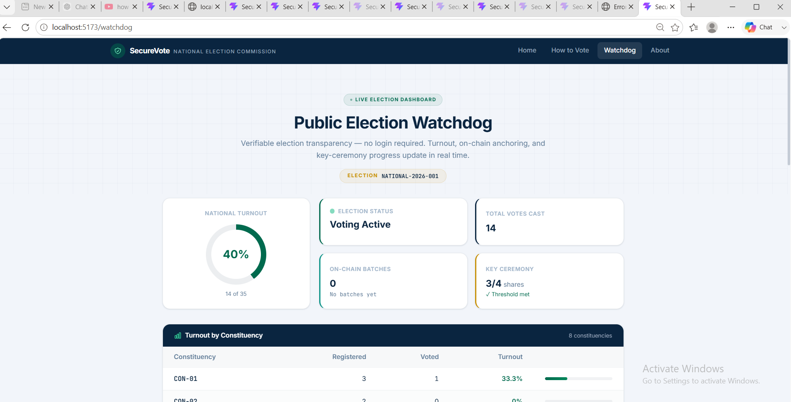
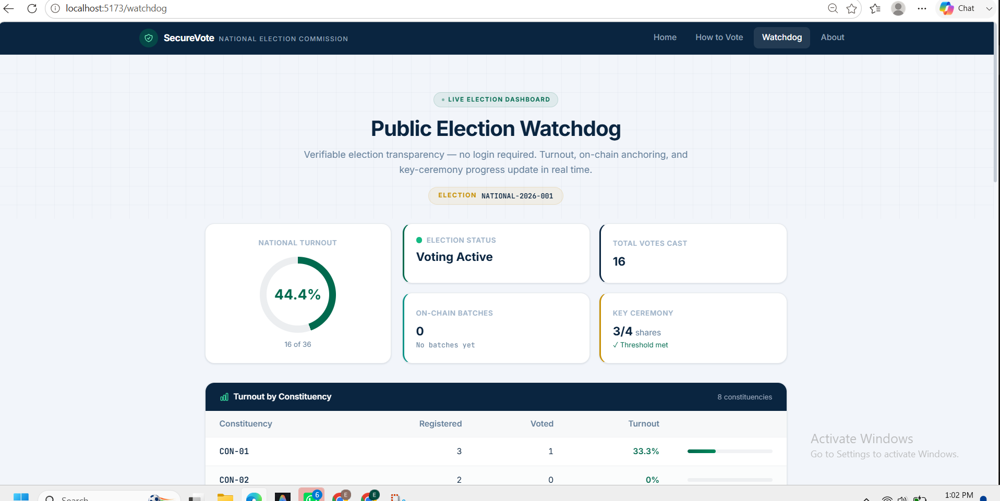
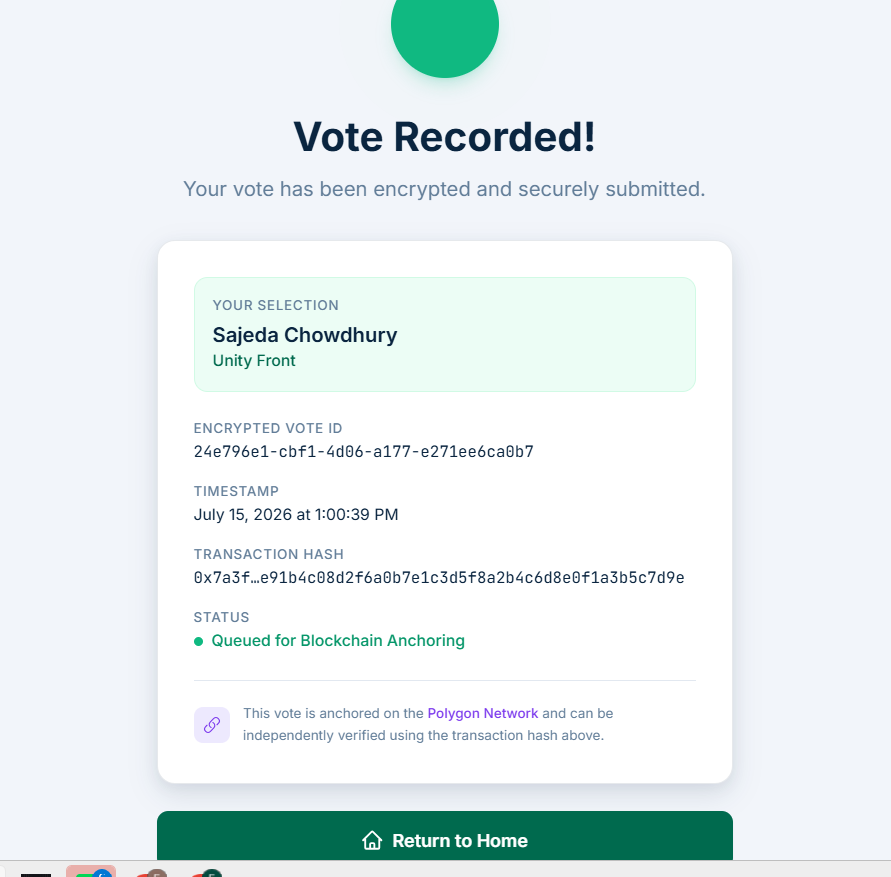
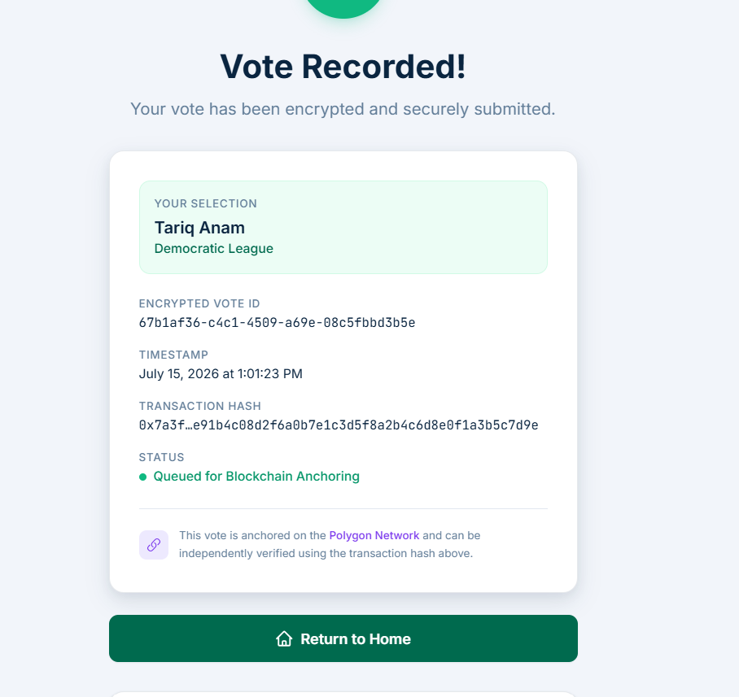

# Vote Anchor Verification & Watchdog QA Report

## Best Case Scenario (Successful Execution - Public Watchdog)
- **Scenario ID:** TS-WD-01
- **Test Case ID:** TC-WD-001
- **Testing Type:** System Testing
- **Objective:** Ensure public dashboards reflect real-time vote metrics.
- **Preconditions:** Votes exist in the database.
- **Test Data:** General public query.
- **Test Steps:**
  1. Fetch statistics from `/public/stats` and observe Watchdog UI before and after a vote.
- **Expected Result:** UI correctly updates Total Votes Cast and National Turnout accurately.
- **Actual Result:** Watchdog successfully updated in real-time, reflecting new votes without leaking voter data.
- **PASS/FAIL:** ✅ PASS
- **Evidence:** 
  - Watchdog Before: 
  - Watchdog After: 
- **Notes:** Public statistical transparency operates correctly.

## Best Case Scenario (Successful Execution - Vote Anchoring)
- **Scenario ID:** TS-ANC-01
- **Test Case ID:** TC-ANC-001
- **Testing Type:** Integration & Security Testing
- **Objective:** Verify that users can mathematically prove their vote is included in the Polygon blockchain anchor.
- **Preconditions:** Vote has been successfully cast.
- **Test Data:** User's specific vote receipt/tracking ID (e.g. `24e796e1-cbf1-4d06-a177-e271ee6ca0b7`).
- **Test Steps:**
  1. Cast a vote.
  2. Request verification via `/verify-vote` or `/anchor/verify/:voteId`.
- **Expected Result:** Backend confirms the vote is verified and queued for anchoring or anchored to a Merkle Root. UI shows "Queued for Blockchain Anchoring" and displays a mock transaction hash.
- **Actual Result:** Vote successfully verified against local Polygon Amoy testnet simulated response.
- **PASS/FAIL:** ✅ PASS
- **Evidence:** 
  - HTTP `200 OK` (See raw payload: [verify_response.json](./verify_response.json))
  - Vote 1 Success: 
  - Vote 2 Success: 
- **Notes:** Blockchain transparency mechanism is functioning locally as designed.

## Worst Case Scenario (Invalid or Misuse Scenario)
- **Scenario ID:** TS-ANC-02
- **Test Case ID:** TC-ANC-002
- **Testing Type:** Security/Tamper-Resistance Testing
- **Objective:** Verify the system's response when querying a fake, non-existent, or tampered Vote Tracking ID against the smart contract.
- **Preconditions:** Backend running.
- **Test Data:** Fake Tracking ID (e.g., `invalid-uuid-1234`).
- **Test Steps:**
  1. Send a GET request to `/anchor/verify/invalid-uuid-1234`.
- **Expected Result:** The system should gracefully report that the ID is invalid (e.g., 400 Bad Request) or that the ID was not found (404 Not Found).
- **Actual Result:** The system failed to handle the malformed UUID safely. Instead of returning a proper validation error, it crashed and returned a generic `500 Internal Server Error`.
- **PASS/FAIL:** ❌ FAIL
- **Evidence:** 
  - **API Endpoint Called:** `GET http://localhost:3000/anchor/verify/invalid-uuid-1234`
  - **Response Payload:** `{"error":"Internal server error"}`
- **Notes:** **QA Defect Logged.** The endpoint lacks UUID format validation before querying the database, causing a crash instead of a safe rejection.
