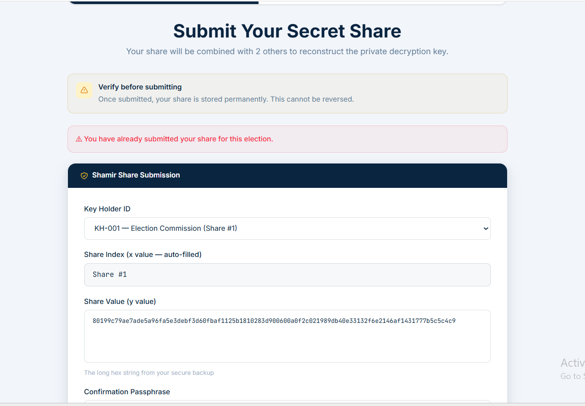
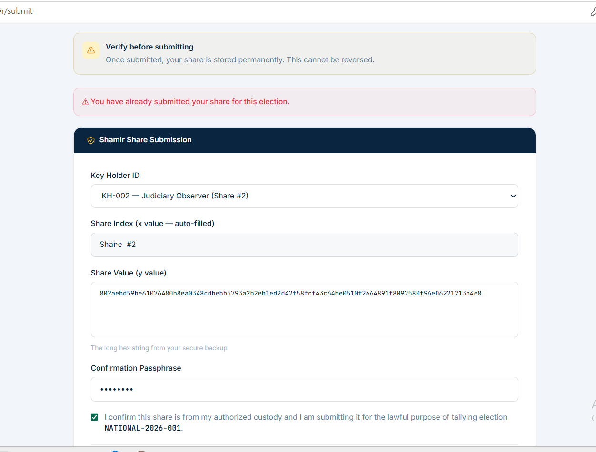

# Duplicate Keyholder Share Submission QA Report

## Best Case Scenario (Successful Execution - Duplicate Share Blocked)
- **Scenario ID:** TS-KEY-01
- **Test Case ID:** TC-KEY-001
- **Testing Type:** Security/Tamper-Resistance Testing
- **Objective:** Prevent keyholders from submitting multiple shares and overriding the Shamir threshold integrity.
- **Preconditions:** Keyholder (`KH-002`) has already submitted their share.
- **Test Data:** Valid keyholder credentials and exact share value string.
- **Test Steps:**
  1. POST to `/keyshares/submit` with an already-used `keyholder_id`.
- **Expected Result:** The database should enforce a unique constraint to prevent multiple entries. The frontend UI should gracefully catch the API rejection and display a clear warning.
- **Actual Result:** The UI successfully intercepted the rejection and displayed the error alert: **"You have already submitted your share for this election."** The duplicate submission was safely blocked.
- **PASS/FAIL:** ✅ PASS
- **Evidence:** 
  - HTTP `409 Conflict` (See raw payload: [duplicate_response.json](./duplicate_response.json))
  - UI Screenshot: 
  - UI Screenshot KH001: 
- **Notes:** Threshold integrity is highly protected from duplicate override attacks.

## Worst Case Scenario (Invalid or Misuse Scenario - Invalid Share Format)
- **Scenario ID:** TS-KEY-02
- **Test Case ID:** TC-KEY-002
- **Testing Type:** Functional Testing (Negative)
- **Objective:** Verify that the system strictly validates the mathematical structure or regex format of a Shamir share before saving it.
- **Preconditions:** Keyholder has not submitted yet.
- **Test Data:** Mathematically incorrect / garbage string.
- **Test Steps:**
  1. Attempt to submit a garbage string as the Shamir share value for a keyholder.
- **Expected Result:** The system should validate the structure of the share (e.g., regex check for proper hex length) and reject it immediately if malformed.
- **Actual Result:** The API only verified that the string was not empty (`z.string().min(1)`), accepted the garbage input, saved it to the database, and returned a `201 Created`. The error is only caught downstream during Tally reconstruction.
- **PASS/FAIL:** ❌ FAIL
- **Evidence:** API returned `201 Created` for invalid input structure.
- **Notes:** **QA Defect Logged.** The backend Zod schema lacks strict regex validation for Shamir shares. Should be addressed to prevent administrative friction during the final tally.
