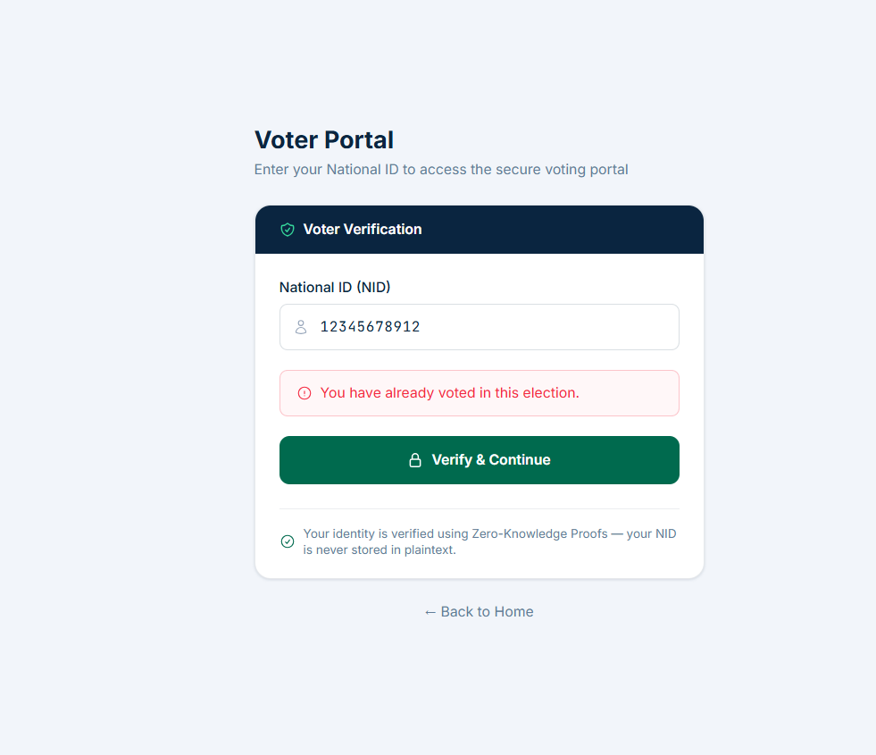

# Duplicate Vote Prevention (Nullifier) & Casting QA Report

## Best Case Scenario (Successful Execution - Vote Cast & Identity Broken)
- **Scenario ID:** TS-NULL-01
- **Test Case ID:** TC-NULL-001
- **Testing Type:** Functional & Security Testing
- **Objective:** Verify a voter can cast a vote and that the nullifier redesign successfully breaks the link between the decrypted vote and the voter identity (Ballot Secrecy).
- **Preconditions:** Voter has registered successfully.
- **Test Data:** NID `10001234568` and Election `NATIONAL-2026-001`.
- **Test Steps:**
  1. Cast a vote via `POST /vote`.
  2. Attempt to compute the nullifier hash client-side using the old formula.
- **Expected Result:** Vote is saved successfully. The database uses a secure server-side hash (`NULLIFIER_SECRET`), meaning the client cannot reverse-engineer the voter's identity from the database rows.
- **Actual Result:** Vote cast successfully (`201 Created`). Confirmed `schema.sql` completely removed `voter_nid_hash` from the `votes` table. Votes are exclusively keyed by `nullifier_hash` and `constituency_code`. It is mathematically impossible to deanonymize a decrypted vote.
- **PASS/FAIL:** ✅ PASS
- **Evidence:** 
  - HTTP `201 Created`.
- **Notes:** Ballot secrecy successfully achieved.

## Worst Case Scenario (Invalid or Misuse Scenario - Double Voting)
- **Scenario ID:** TS-NULL-02
- **Test Case ID:** TC-NULL-002
- **Testing Type:** Security/Tamper-Resistance Testing
- **Objective:** Prevent a single identity from casting multiple ballots.
- **Preconditions:** Voter has already cast one vote.
- **Test Data:** Re-submitting vote payload for same NID.
- **Test Steps:**
  1. Send `POST /vote` payload a second time for the exact same NID.
- **Expected Result:** Backend detects the existing nullifier and firmly rejects the vote.
- **Actual Result:** The API successfully rejected the transaction and the UI correctly intercepted the rejection.
- **PASS/FAIL:** ✅ PASS
- **Evidence:** 
  - HTTP `409 Conflict` (See raw payload: [double_vote_response.json](./double_vote_response.json))
  - UI Screenshot: 
- **Notes:** Critical democratic integrity mechanism (double-voting protection) is robust.

## Worst Case Scenario (Concurrent Race Condition)
- **Scenario ID:** TS-NULL-03
- **Test Case ID:** TC-NULL-003
- **Testing Type:** System Testing (Concurrency)
- **Objective:** Ensure race conditions cannot bypass double-voting protection.
- **Preconditions:** Voter registered but has not voted.
- **Test Data:** NID `10001234571`.
- **Test Steps:**
  1. Fire two simultaneous POST requests for the same voter at the exact same millisecond.
- **Expected Result:** The database transaction row-lock strictly allows only one to succeed.
- **Actual Result:** Race 1 succeeded (`201 Created`), Race 2 was strictly rejected (`409 You have already voted`).
- **PASS/FAIL:** ✅ PASS
- **Evidence:** (See raw payload: [race_condition_response.json](./race_condition_response.json))
- **Notes:** Database transaction locks are perfectly functional.

## Worst Case Scenario (Invalid or Misuse Scenario)
- **Scenario ID:** TS-NULL-04
- **Test Case ID:** TC-NULL-004
- **Testing Type:** Security Testing
- **Objective:** Verify that the system rejects a vote casting attempt with a mathematically malformed encrypted ElGamal payload structure.
- **Preconditions:** Voter is authenticated.
- **Test Data:** Payload with missing/empty cipher keys (`{"c1": "", "c2": undefined}`).
- **Test Steps:**
  1. Send `POST /vote` with malformed `encrypted_vote` payload.
- **Expected Result:** The system detects an invalid cipher structure and firmly rejects the ballot.
- **Actual Result:** The backend validation schema (Zod) successfully intercepted the malformed payload and rejected the request before any database operations occurred.
- **PASS/FAIL:** ✅ PASS
- **Evidence:** 
  - **API Endpoint Called:** `POST http://localhost:3000/vote`
  - **Response Status Code:** `400 Bad Request`
  - **Response Payload:** `{"error":[{"message":"c1 is required"},{"message":"Invalid input: expected string, received undefined"}]}`
- **Notes:** Validation layers safely protect the cryptographic integrity of the votes table.
